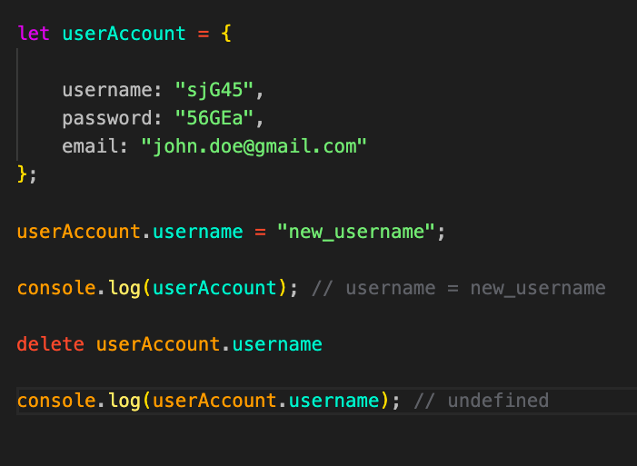

# Javascript Fundamentals II [Mikael Eriksson]

#### Data Types

- Boolean // true or false
- Numbers // numeric values
- Strings // "this is a string"  <====> "1"
- operators // (+) (-) (%) (/) (*=) (-=) (+=)  operators we can use for Arithmetic calculations.

- List // Are arrays containing either strings numbers or objects
- Keys and values // refer to objects (key) => car = (properties =>) color: #888

#### functions

- Functions is a block of code which is assigned to a specific task.
- Functions are resuable and can be called upon in different scenarios .

#### scope

- block scope // variables being declared inside functions are locked for access inside its scope

- global scope // globla variables can be accessed and used by any functions
- function scope // Each function creates a new scope. and only be executed in that context
#### Arrays

- Arrays is a data structure and represents a list of elements ex. (objects,strings,numbers).

![image] (images/)

#### array functions

- push() // pushes a elements to a array
- filter() // filter out x amount elements in a descending order
- map() // create a new array with the pre-existing elements
- pop() // remove a elements from the array

#### conditions

- if // else statements // is a boolean control statements to check if a condition is true or false 

#### Objects

- Objects is code block with a set of properties and methods
- Ex. let Car = { model: Mercedes color: blue  };
- When we work with big dataset, objects  is a more efficient  way to structure data then just using a array.

- The name of a object is called a key.

- To access a object we use key name to access and modify or add new properties of the object. (Example below)how to access and manipulate properties.

#### Localstorage & SessionStorage

- local and sessionsStorage both store readable properties. localstored properties can be accessed again when the 

- Session Storage // store data until the tab is closed.

- LocalStorage // store data with no expiration date( not recomended ) (can store between 2mb up to 10mb).

#### API : Application programming Interface

- fetch API //
- Async / Await //
- Promise 

#### Github

- pull request
- merge

